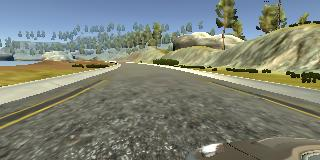
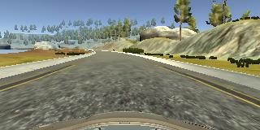
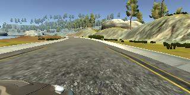

#**Behavioral Cloning** 

##Writeup Template

###You can use this file as a template for your writeup if you want to submit it as a markdown file, but feel free to use some other method and submit a pdf if you prefer.

---

**Behavrioal Cloning Project**

The goals / steps of this project are the following:
* Use the simulator to collect data of good driving behavior
* Build, a convolution neural network in Keras that predicts steering angles from images
* Train and validate the model with a training and validation set
* Test that the model successfully drives around track one without leaving the road
* Summarize the results with a written report


NOTE: I used the stable simulator provided by the TA to get the results.

The Solution I describe, sucessfully drives the car on track1 and track2 provided by the simulator.


You can find the videos for the result in the repository. They are called runtrack1.mp4 and runtrack2.mp4


For the beta simulator: the car is able to drive successfully on track1. It's the same as the track1 for the stable simulator.


For track2 it fails and it goes off the track immediately. This is because there is no railing on the road. Secondly the outside edge of 


the road is marked white, so the model think it is a lane and hence drives off the road. This could be fixed IMO by using lane detection


from P1. But any other suggestion would be highly helpful for this track.


Also, if there are more tracks like this somewhere, a pointer to that would be greatly helpful.

## Rubric Points
###Here I will consider the [rubric points](https://review.udacity.com/#!/rubrics/432/view) individually and describe how I addressed each point in my implementation.  

---
###Files Submitted & Code Quality

####1. Submission includes all required files and can be used to run the simulator in autonomous mode

My project includes the following files:
* model.py containing the script to create and train the model
* drive.py for driving the car in autonomous mode
* model.h5 containing a trained convolution neural network 
* writeup_report.md summarizing the results

####2. Submssion includes functional code
Using the Udacity provided simulator and my drive.py file, the car can be driven autonomously around the track by executing 
```sh
python drive.py model.h5
```
Note: For the drive.py script I also added max_speed_limit and min_speed_limit. Somebody mentioned in the forum about this and I thought this might be useful for thresholding the speed while making steep turns. Then realized we are in simulator world and some laws of physics clearly don't work.


Still decided to keep them and threshold the speed.

####3. Submssion code is usable and readable

The model.py file contains the code for training and saving the convolution neural network. The file shows the pipeline I used for training and validating the model, and it contains comments to explain how the code works.

###Model Architecture and Training Strategy

####1. An appropriate model arcthiecture has been employed

My model has been designed referencing the Nvidia and comma.ai model.

The details for the model are as follows:

1. Cropping layer of size (5,10) which crops the incomming input image.

2. Normalization layer which does x / 255.0 - 0.5 on each pixel.

3. Convolution2D of size (16, 8, 8) -> MaxPooling2D of size (2,2) -> Dropout(0.5) -> RELU activation.

4. Convolution2D of size (32, 5, 5) -> MaxPooling2D of size (2,2) -> Dropout(0.5) -> RELU activation.

5. Convolution2D of size (64, 5, 5) -> MaxPooling2D of size (2,2) -> Dropout(0.5) -> RELU activation.

6. Flatten() -> Dropout(0.2) -> RELU -> FullyConnected(512) -> Dropout(0.2) -> RELU activation.

7. FullyConnected(1) [Output Layer]


####2. Attempts to reduce overfitting in the model

The model contains dropout layers in order to reduce overfitting. 

The model was trained and validated on different data sets to ensure that the model was not overfitting (look at generator code and model.fit_generator function). 
I have used 20480 samples_per_epoch.

The model was tested by running it through the simulator and ensuring that the vehicle could stay on the track.

####3. Model parameter tuning

The model used an adam optimizer, so the learning rate was not tuned manually.

####4. Appropriate training data

Training data was chosen to keep the vehicle driving on the road. I used the training data provided by the TA and then extended it.

###Model Architecture and Training Strategy

####1. Solution Design Approach

The overall strategy for deriving a model architecture was to look at other models especially that of nvidia and comma.ai.
From the lectures, I figured that one should use MaxPooling2d to reduce the number of parameters and for regularization. This speed up the training time on my laptop.
Simple, not much thought was put into it otherwise because I didn't find it necessary to do so.

I also sprinkled some DropOut layers for regulariaztion.

For extremely sharp turn the vechile was still going out of the track. To counter this I put a threshold of 0.25(see drive.py) for a turn to be described as sharp
and whenever a turn crossed that threshold we would just turn the steering wheel to its max in the direction which would counteract the turn.

At the end of the process, the vehicle is able to drive autonomously around track1 and track2 without leaving the road for the stable simulator.

####2. Final Model Architecture

Please see above for the model architecture.

####3. Creation of the Training Set & Training Process

The technique I used for extension of provided Training data by TA is as follows:

First I used the left and right camera images as center camera images with the same steering angle.

Then I added a correction factor to that steering angle to make the turns sharper.

This made the training set 3X in size. 

Training against this dataset alivated a lot of problems and prevented the car from going off track for moderately sharp turns.

After the collection process, I had ~24000 number of data points.

Then for training the usual stuff was done: shuffle the training samples and for each batch shuffle the batch for training.

I put 20% of the data into a validation set. 

I used an epoch of 5 and adam optimizer for learning.

Here are some images from the training dataset:

left:



center:



right:




#### Results:

The result videos are runtrack1.mp4 and runtrack2.mp4 for the two tracks.
